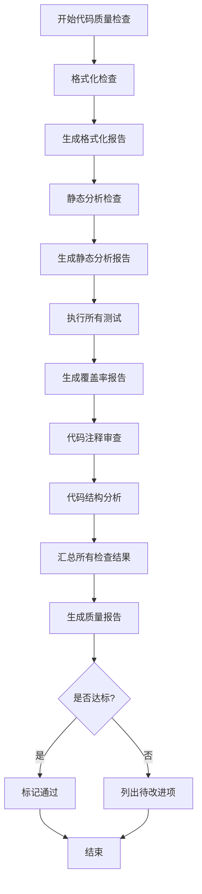
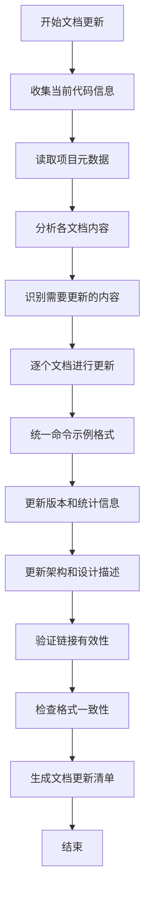

# 代码质量检查与全文档更新设计

## 1. 需求概述

对 cmd4coder 项目进行全面的代码质量检查，并更新项目中的所有文档，确保代码质量符合规范标准，文档内容准确、完整、一致。

## 2. 设计目标

### 2.1 代码质量目标
- 代码格式规范统一，符合 Go 官方规范
- 静态分析无错误和严重警告
- 测试覆盖率达到预期目标（≥80%）
- 代码结构清晰，注释完整

### 2.2 文档更新目标
- 所有文档内容准确反映当前代码状态
- 命令示例统一且可执行
- 文档结构完整，无缺失或过时内容
- 格式统一，链接有效

## 3. 代码质量检查方案

### 3.1 检查维度

#### 3.1.1 格式化检查
**检查项**：
- 代码格式是否符合 gofmt 标准
- 导入包的顺序和分组
- 代码缩进和对齐

**检查方法**：
- 执行 go fmt 命令检查所有 Go 文件
- 使用 goimports 检查导入规范

**范围**：
- cmd/ 目录下所有 .go 文件
- internal/ 目录下所有 .go 文件
- pkg/ 目录下所有 .go 文件
- test/ 目录下所有 .go 文件

#### 3.1.2 静态分析检查
**检查项**：
- 可疑的代码构造
- 潜在的 bug
- 未使用的变量和导入
- 错误处理缺失
- 并发安全问题

**检查方法**：
- 执行 go vet 进行基础静态分析
- 使用 golangci-lint 进行全面代码检查

**重点检查规则**：
- errcheck：错误处理检查
- staticcheck：静态分析
- unused：未使用代码检查
- gosimple：简化建议
- ineffassign：无效赋值检查
- govet：go vet 所有检查

#### 3.1.3 测试覆盖率检查
**检查项**：
- 单元测试覆盖率
- 集成测试覆盖率
- 测试代码质量

**检查方法**：
- 执行全部测试用例
- 生成覆盖率报告
- 分析未覆盖的代码分支

**目标指标**：
| 模块 | 覆盖率目标 |
|------|-----------|
| internal/model | ≥85% |
| internal/data | ≥85% |
| internal/service | ≥85% |
| pkg/export | ≥80% |
| cmd/cli | ≥50% |
| 总体 | ≥80% |

#### 3.1.4 代码注释检查
**检查项**：
- 公开函数是否有注释
- 包级注释是否存在
- 复杂逻辑是否有说明
- 注释是否准确反映代码功能

**检查范围**：
- 所有导出的函数、类型、常量
- 所有包的 package 注释
- 复杂算法和业务逻辑

#### 3.1.5 代码结构检查
**检查项**：
- 包依赖关系是否合理
- 循环依赖检查
- 函数复杂度
- 文件和函数长度

**检查标准**：
- 无循环依赖
- 单个函数代码行数建议 ≤100 行
- 圈复杂度建议 ≤15
- 单个文件建议 ≤500 行

### 3.2 检查执行流程



### 3.3 检查结果记录

检查结果应包含以下内容：

**格式化检查结果**：
- 需要格式化的文件列表
- 格式问题统计

**静态分析结果**：
- 发现的问题按严重程度分类
- 每个问题的位置和描述
- 建议的修复方案

**测试覆盖率结果**：
- 各模块覆盖率统计表
- 未覆盖代码清单
- 缺失测试的功能点

**注释检查结果**：
- 缺少注释的导出成员列表
- 不准确或过时的注释

**结构检查结果**：
- 复杂度超标的函数
- 过长的文件
- 依赖关系图

## 4. 文档更新方案

### 4.1 文档清单

根据项目结构，需要更新的文档包括：

#### 4.1.1 根目录文档
| 文档名称 | 主要内容 | 更新重点 |
|---------|---------|---------|
| README.md | 项目介绍、快速开始、使用说明 | 命令示例、功能列表、版本信息 |
| ARCHITECTURE.md | 架构设计、技术方案 | 架构图、模块说明、设计决策 |
| CONTRIBUTING.md | 贡献指南、开发规范 | 提交流程、代码规范、测试要求 |
| CODE_OF_CONDUCT.md | 行为准则 | 内容审查 |
| CHANGELOG.md | 变更日志 | 版本历史、更新内容 |
| COMPLETION_REPORT.md | 项目完成报告 | 项目状态、交付内容 |
| DELIVERY_SUMMARY.md | 交付摘要 | 交付物清单、验收标准 |
| EXECUTION_SUMMARY.md | 执行摘要 | 执行过程、关键节点 |
| FINAL_REPORT.md | 最终报告 | 项目总结、成果展示 |
| PROJECT_STATUS.md | 项目状态 | 当前进度、待办事项 |
| TEST_REPORT.md | 测试报告 | 测试结果、覆盖率数据 |
| GITHUB_PAGES.md | GitHub Pages 说明 | 页面访问、功能介绍 |

#### 4.1.2 docs 目录文档
| 文档名称 | 主要内容 | 更新重点 |
|---------|---------|---------|
| docs/README.md | 文档导航 | 文档结构、链接有效性 |
| docs/DEPLOYMENT.md | 部署指南 | 部署步骤、环境要求 |
| docs/IMPLEMENTATION_SUMMARY.md | 实现摘要 | 技术实现、关键功能 |

#### 4.1.3 构建脚本
| 文件名称 | 主要内容 | 更新重点 |
|---------|---------|---------|
| build.sh | Linux/macOS 构建脚本 | 构建命令、输出路径 |
| build.ps1 | Windows 构建脚本 | 构建命令、输出路径 |

### 4.2 文档更新内容

#### 4.2.1 命令示例统一化

**当前问题**：
- 部分文档使用 cmd4coder 作为命令示例
- 实际执行时需要使用 go run ./cmd/cli 或构建后的二进制文件

**统一方案**：
所有文档中的命令示例统一说明执行方式，并在示例中使用 go run ./cmd/cli 作为开发模式的标准命令

**执行说明格式**：
```
> **注意**: 以下示例中的 `cmd4coder` 可替换为以下任一方式执行：
> - **开发模式**: `go run ./cmd/cli`
> - **构建后**: `./build/cmd4coder-v1.0.0-windows-amd64.exe` (Windows) 或对应平台的可执行文件
> - **安装后**: 如果已通过 `go install ./cmd/cli` 安装，可直接使用 `cli`
```

**命令示例统一格式**：
```bash
# 使用 go run ./cmd/cli 作为标准示例
go run ./cmd/cli list -d ./data
go run ./cmd/cli search file -d ./data
```

#### 4.2.2 版本信息更新

**更新项**：
- Go 版本要求
- 项目版本号
- 依赖包版本
- 支持的平台列表

**检查依据**：
- go.mod 文件中的 Go 版本声明
- 构建脚本中的版本信息
- 实际测试的平台支持情况

#### 4.2.3 功能特性更新

**更新项**：
- 命令清单统计数据
- 功能特性列表
- 支持的分类和工具

**数据来源**：
- data/ 目录下的 YAML 文件
- metadata.yaml 中的元数据
- 实际实现的功能

#### 4.2.4 架构和设计文档更新

**更新项**：
- 架构图与实际代码一致
- 模块职责描述准确
- 数据流程图反映当前实现
- 设计决策与代码对应

**验证方法**：
- 对照源代码检查架构描述
- 验证模块划分和依赖关系
- 确认设计方案已实现

#### 4.2.5 开发和贡献文档更新

**更新项**：
- 环境搭建步骤
- 构建和运行命令
- 测试执行方法
- 代码规范说明
- 提交流程指南

**验证方法**：
- 实际执行文档中的命令
- 确保步骤可以成功执行
- 验证规范与实际开发一致

### 4.3 文档更新流程



### 4.4 文档质量标准

#### 4.4.1 内容准确性
- 代码示例可正确执行
- 版本信息与实际一致
- 统计数据准确无误
- 技术描述反映实际实现

#### 4.4.2 格式一致性
- Markdown 格式规范
- 标题层级结构清晰
- 代码块语言标注正确
- 表格格式统一

#### 4.4.3 完整性
- 必要的章节完整
- 关键信息无遗漏
- 示例充分且实用
- 链接完整有效

#### 4.4.4 可读性
- 语言表达清晰
- 结构层次分明
- 排版美观
- 重点突出

## 5. 质量改进建议

### 5.1 代码改进方向

基于检查结果，可能的改进方向：

**格式和风格**：
- 统一代码格式
- 优化导入包顺序
- 改进命名规范

**错误处理**：
- 完善错误处理逻辑
- 使用错误包装保留上下文
- 添加必要的错误类型

**测试完善**：
- 为未覆盖代码补充测试
- 增加边界条件测试
- 添加性能基准测试

**代码注释**：
- 为公开接口添加注释
- 补充复杂逻辑说明
- 更新过时注释

**代码结构**：
- 重构复杂函数
- 拆分过长文件
- 优化依赖关系

### 5.2 文档改进方向

**内容完善**：
- 补充缺失的章节
- 丰富使用示例
- 添加常见问题解答

**格式优化**：
- 统一文档风格
- 改进表格和列表格式
- 优化代码块展示

**结构调整**：
- 优化文档层次结构
- 改进文档间的链接
- 完善文档索引

**实用性提升**：
- 增加实际操作指南
- 提供问题排查步骤
- 添加最佳实践建议

## 6. 输出交付物

### 6.1 代码质量检查报告

**报告内容**：

#### 总体概况
- 检查范围统计
- 整体质量评分
- 主要发现摘要

#### 详细检查结果

**格式化检查**：
- 格式问题统计
- 需要格式化的文件列表

**静态分析**：
| 严重程度 | 问题数量 | 占比 |
|---------|---------|------|
| 错误 | X | X% |
| 警告 | X | X% |
| 提示 | X | X% |

详细问题列表按模块分类展示

**测试覆盖率**：
| 模块 | 语句覆盖率 | 分支覆盖率 | 达标状态 |
|------|-----------|-----------|---------|
| internal/model | X% | X% | ✅/❌ |
| internal/data | X% | X% | ✅/❌ |
| internal/service | X% | X% | ✅/❌ |
| pkg/export | X% | X% | ✅/❌ |
| cmd/cli | X% | X% | ✅/❌ |
| 总体 | X% | X% | ✅/❌ |

**注释检查**：
- 缺少注释的导出成员数量
- 详细清单

**结构分析**：
- 复杂度超标函数列表
- 过长文件列表
- 依赖关系分析

#### 改进建议
- 按优先级排序的改进项
- 每项的详细说明和修复建议

### 6.2 文档更新清单

**清单内容**：

| 文档名称 | 更新状态 | 主要更新内容 | 备注 |
|---------|---------|-------------|------|
| README.md | ✅ 已更新 | 命令示例统一化、版本信息更新 | |
| ARCHITECTURE.md | ✅ 已更新 | 架构描述与代码一致性检查 | |
| CONTRIBUTING.md | ✅ 已更新 | 开发流程和规范更新 | |
| ... | ... | ... | ... |

**详细更新说明**：
每个文档的具体更新内容列表

### 6.3 质量改进计划（可选）

如果检查发现需要改进的问题，可以输出改进计划：

**优先级分级**：
- P0 严重问题：必须立即修复
- P1 重要问题：应尽快修复
- P2 一般问题：可以计划修复
- P3 建议优化：可以择机优化

**改进任务列表**：

| 任务 | 类型 | 优先级 | 工作量估计 | 负责人 |
|------|------|-------|----------|--------|
| 修复静态分析错误 | 代码 | P0 | 2小时 | |
| 补充测试覆盖 | 测试 | P1 | 4小时 | |
| 完善代码注释 | 文档 | P2 | 3小时 | |
| 优化复杂函数 | 重构 | P2 | 5小时 | |

**实施时间线**：
建议的修复和优化时间安排

## 7. 验收标准

### 7.1 代码质量验收标准

- ✅ 所有 Go 文件通过 go fmt 检查
- ✅ go vet 无错误输出
- ✅ golangci-lint 无严重错误和警告
- ✅ 测试覆盖率达到目标（总体 ≥80%，核心模块 ≥85%）
- ✅ 所有导出的函数、类型有完整注释
- ✅ 无严重的代码结构问题

### 7.2 文档质量验收标准

- ✅ 所有文档内容准确反映当前代码状态
- ✅ 命令示例统一且可执行
- ✅ 版本信息与实际一致
- ✅ Markdown 格式规范，无格式错误
- ✅ 文档内链接有效
- ✅ 无明显的错别字和语法错误
- ✅ 文档结构完整，关键章节无缺失

### 7.3 交付物验收标准

- ✅ 提供完整的代码质量检查报告
- ✅ 提供文档更新清单
- ✅ 如有质量问题，提供改进建议
- ✅ 所有检查结果有据可查

## 8. 注意事项

### 8.1 检查过程注意事项

- 使用最新版本的检查工具
- 检查前确保代码可编译通过
- 关注检查工具的误报，人工判断必要性
- 保存原始检查输出用于追溯

### 8.2 更新过程注意事项

- 更新前备份原始文档
- 保持文档更新的一致性
- 验证所有命令示例的可执行性
- 确保链接更新后仍然有效
- 注意文档间的交叉引用

### 8.3 质量标准注意事项

- 覆盖率目标是指导性的，不应为了达标而写无效测试
- 代码注释重在质量而非数量
- 某些合理的静态分析警告可以忽略，但需说明原因
- 文档更新应关注实用性，避免过度冗长

## 9. 执行建议

### 9.1 执行顺序

建议按以下顺序执行：

1. 代码格式化检查和修复（快速）
2. 静态分析检查（中等）
3. 测试执行和覆盖率分析（中等）
4. 代码注释审查（较慢）
5. 代码结构分析（较慢）
6. 文档内容收集和分析（中等）
7. 文档逐个更新（较慢）
8. 文档验证和校对（中等）
9. 生成报告和清单（快速）

### 9.2 时间分配建议

| 阶段 | 预估时间 | 说明 |
|------|---------|------|
| 代码质量检查 | 2-3 小时 | 自动化工具为主 |
| 代码问题分析 | 1-2 小时 | 人工分析检查结果 |
| 文档内容收集 | 1 小时 | 读取和分析现有文档 |
| 文档更新 | 3-4 小时 | 根据文档数量调整 |
| 验证和校对 | 1-2 小时 | 确保质量 |
| 报告编写 | 1 小时 | 汇总和整理 |
| **总计** | **9-13 小时** | 可分多次完成 |

### 9.3 工具准备

**必需工具**：
- Go 工具链（go fmt, go vet, go test）
- 文本编辑器或 IDE

**推荐工具**：
- golangci-lint（静态分析）
- goimports（导入管理）
- gocover（覆盖率可视化）
- markdownlint（Markdown 检查）

**工具安装**：
```bash
# golangci-lint
go install github.com/golangci/golangci-lint/cmd/golangci-lint@latest

# goimports
go install golang.org/x/tools/cmd/goimports@latest
```
