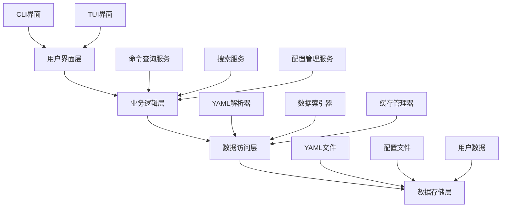
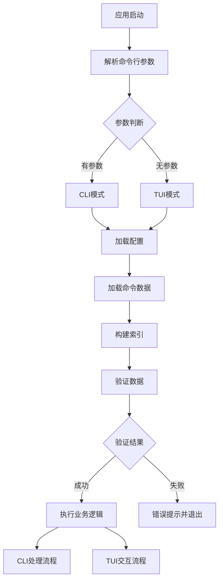
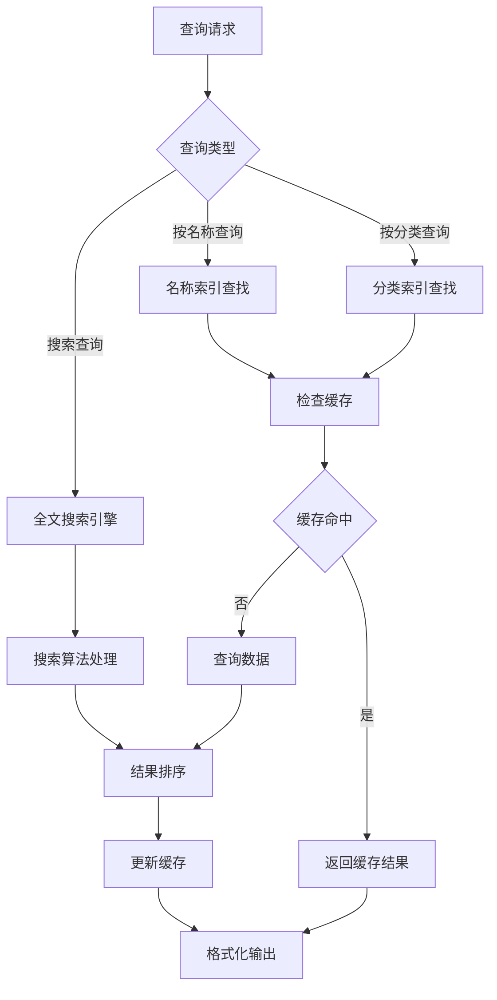
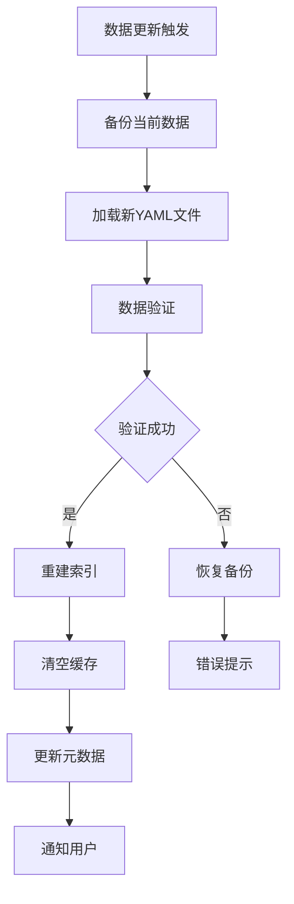
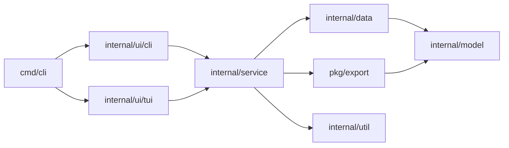

# 命令行工具集成设计文档

## 一、项目概述

### 1.1 项目定位
cmd4coder 是一个面向运维工程师和开发者的命令行工具大全，通过Go语言实现，提供简单优雅的用户体验。该工具旨在帮助用户快速查询、学习和使用各类命令行工具，涵盖操作系统、编程语言、运维监控等多个领域。

### 1.2 核心价值
- 统一的命令行工具知识库，减少查询文档的时间成本
- 完整的命令详解，包含功能说明、使用方式、注意事项和风险提示
- 支持传统命令行和交互式界面两种使用模式
- 本地化存储，无需网络即可使用
- 高质量的命令清单，经过验证和测试

### 1.3 目标用户
- 运维工程师：需要快速查询各类运维命令
- 后端开发者：需要了解Java、Go、Python等工具链命令
- 系统管理员：需要掌握不同Linux发行版的系统命令
- 技术学习者：希望系统学习命令行工具的使用

## 二、功能设计

### 2.1 命令清单管理

#### 2.1.1 清单分类体系

| 一级分类 | 二级分类 | 说明 |
|---------|---------|------|
| 操作系统 | Ubuntu系统命令 | Ubuntu发行版自带的系统命令 |
| 操作系统 | CentOS系统命令 | CentOS/RHEL发行版自带的系统命令 |
| 操作系统 | 通用Linux命令 | 各Linux发行版通用的基础命令 |
| 编程语言 | Java工具链 | JDK自带工具(javac、java、jps、jstat等) |
| 编程语言 | Go工具链 | Go语言工具链(go build、go test等) |
| 编程语言 | Python工具链 | Python相关工具(pip、virtualenv等) |
| 编程语言 | Node.js工具链 | Node.js和npm相关工具 |
| 诊断工具 | Java诊断 | Arthas等Java应用诊断工具 |
| 诊断工具 | 系统诊断 | tsar、dstat等系统性能诊断工具 |
| 网络工具 | DNS工具 | dig、nslookup等DNS查询工具 |
| 网络工具 | 网络诊断 | tcpdump、netstat、ss等网络诊断工具 |
| 网络工具 | HTTP工具 | curl、wget等HTTP客户端工具 |
| 容器编排 | Docker命令 | Docker容器管理命令 |
| 容器编排 | Kubernetes命令 | kubectl等K8s管理命令 |
| 数据库工具 | MySQL工具 | mysql、mysqldump等MySQL客户端工具 |
| 数据库工具 | Redis工具 | redis-cli等Redis客户端工具 |
| 数据库工具 | PostgreSQL工具 | psql等PostgreSQL客户端工具 |
| 版本控制 | Git命令 | Git版本控制命令 |
| 版本控制 | SVN命令 | SVN版本控制命令 |
| 构建工具 | Maven | Maven构建工具命令 |
| 构建工具 | Gradle | Gradle构建工具命令 |
| 构建工具 | Make | Make构建工具命令 |

#### 2.1.2 命令清单结构

每个命令条目包含以下信息:

| 字段名 | 类型 | 必填 | 说明 |
|-------|------|------|------|
| name | 字符串 | 是 | 命令名称 |
| category | 字符串 | 是 | 所属分类(一级/二级) |
| install_required | 布尔值 | 是 | 是否需要单独安装 |
| install_method | 字符串 | 否 | 安装方式说明 |
| description | 字符串 | 是 | 命令功能简述 |
| usage | 字符串列表 | 是 | 常用使用方式 |
| options | 选项列表 | 是 | 常用选项说明 |
| examples | 示例列表 | 是 | 使用示例 |
| notes | 字符串列表 | 否 | 注意事项 |
| risks | 风险列表 | 否 | 风险说明(级别+描述) |
| related_commands | 字符串列表 | 否 | 相关命令 |
| platforms | 字符串列表 | 是 | 支持的平台 |
| versions | 版本信息 | 否 | 版本兼容性说明 |
| references | 字符串列表 | 否 | 参考链接 |

风险级别定义:
- low: 低风险，一般操作
- medium: 中风险，需谨慎操作
- high: 高风险，可能影响系统稳定性
- critical: 严重风险，可能导致数据丢失或系统崩溃

### 2.2 交互模式设计

#### 2.2.1 命令行参数模式

用户通过命令行参数直接查询和操作，适合快速查询和脚本调用。

主要操作类型:

| 操作 | 功能描述 | 预期输出 |
|------|---------|---------|
| 列出分类 | 显示所有可用的命令分类 | 分类树形结构 |
| 列出命令 | 显示指定分类下的所有命令 | 命令列表(名称+简述) |
| 查看详情 | 显示指定命令的完整信息 | 格式化的命令详解 |
| 搜索命令 | 按关键字搜索命令 | 匹配的命令列表 |
| 显示版本 | 显示工具版本信息 | 版本号和构建信息 |
| 显示帮助 | 显示使用帮助 | 帮助文档 |

输出格式特性:
- 支持彩色输出(可通过参数禁用)
- 支持表格化展示
- 支持Markdown格式导出
- 支持JSON格式导出

#### 2.2.2 交互式TUI模式

提供类似文件管理器的交互式界面，适合浏览和学习。

界面布局:

```
┌─────────────────────────────────────────────────────────┐
│ cmd4coder - 命令行工具大全                    v1.0.0    │
├──────────────┬──────────────────────────────────────────┤
│              │                                          │
│  分类列表    │         命令列表/详情展示区              │
│              │                                          │
│ > 操作系统   │                                          │
│   Ubuntu     │                                          │
│   CentOS     │                                          │
│ > 编程语言   │                                          │
│   Java       │                                          │
│   Go         │                                          │
│   Python     │                                          │
│              │                                          │
│              │                                          │
├──────────────┴──────────────────────────────────────────┤
│ 快捷键: ↑/↓移动 Enter选择 /搜索 q退出 Tab切换        │
└─────────────────────────────────────────────────────────┘
```

交互功能:
- 左侧面板：分类树导航
- 右侧面板：命令列表或详情展示
- 支持键盘快捷键操作
- 支持模糊搜索
- 支持收藏功能
- 支持历史记录

#### 2.2.3 模式切换策略

应用启动行为判断:
- 无参数启动：进入交互式TUI模式
- 有参数启动：执行命令行参数模式并退出
- 特定参数(--interactive/-i)：强制进入TUI模式

### 2.3 数据存储设计

#### 2.3.1 YAML数据结构

数据文件组织方式:

```
data/
├── metadata.yaml           # 元数据(版本、更新时间等)
├── os/
│   ├── ubuntu.yaml        # Ubuntu命令清单
│   ├── centos.yaml        # CentOS命令清单
│   └── common.yaml        # 通用Linux命令
├── lang/
│   ├── java.yaml          # Java工具链
│   ├── go.yaml            # Go工具链
│   ├── python.yaml        # Python工具链
│   └── nodejs.yaml        # Node.js工具链
├── diagnostic/
│   ├── arthas.yaml        # Arthas诊断工具
│   └── tsar.yaml          # tsar系统诊断工具
├── network/
│   ├── dns.yaml           # DNS工具(dig等)
│   ├── diagnostic.yaml    # 网络诊断工具
│   └── http.yaml          # HTTP工具
├── container/
│   ├── docker.yaml        # Docker命令
│   └── kubernetes.yaml    # Kubernetes命令
├── database/
│   ├── mysql.yaml         # MySQL工具
│   ├── redis.yaml         # Redis工具
│   └── postgresql.yaml    # PostgreSQL工具
├── vcs/
│   ├── git.yaml           # Git命令
│   └── svn.yaml           # SVN命令
└── build/
    ├── maven.yaml         # Maven命令
    ├── gradle.yaml        # Gradle命令
    └── make.yaml          # Make命令
```

YAML文件结构示例(概念性描述):

元数据文件包含:
- 数据版本号
- 最后更新时间
- 分类索引映射
- 数据文件清单

命令清单文件包含:
- 分类信息(名称、描述)
- 命令列表数组
- 每个命令包含前述的所有字段

#### 2.3.2 数据加载策略

加载机制:
- 应用启动时加载所有YAML文件到内存
- 构建命令名称到命令对象的索引
- 构建分类到命令列表的索引
- 构建关键字到命令的倒排索引(用于搜索)

数据验证:
- 启动时验证YAML文件格式正确性
- 验证必填字段完整性
- 验证分类引用的有效性
- 验证风险级别枚举值的合法性

缓存机制:
- 内存缓存所有命令数据
- 预计算常用查询结果
- 搜索结果缓存(最近N次查询)

### 2.4 搜索功能设计

#### 2.4.1 搜索维度

| 搜索类型 | 搜索范围 | 匹配规则 |
|---------|---------|---------|
| 命令名称搜索 | name字段 | 模糊匹配、前缀匹配 |
| 功能描述搜索 | description字段 | 关键词匹配 |
| 全文搜索 | 所有文本字段 | 关键词匹配 |
| 标签搜索 | category、platforms | 精确匹配 |

#### 2.4.2 搜索算法

排序策略:
- 命令名称完全匹配优先级最高
- 命令名称前缀匹配次之
- 描述关键词匹配再次
- 其他字段匹配最低
- 同优先级按字母序排序

搜索优化:
- 预构建倒排索引
- 支持拼音首字母搜索(可选)
- 支持搜索历史记录
- 支持搜索建议(did you mean)

### 2.5 用户配置设计

#### 2.5.1 配置文件

配置文件位置:
- 默认: `~/.cmd4coder/config.yaml`
- 可通过环境变量或参数指定

配置项:

| 配置项 | 类型 | 默认值 | 说明 |
|-------|------|--------|------|
| color_enabled | 布尔值 | true | 是否启用彩色输出 |
| default_mode | 字符串 | auto | 默认模式(cli/tui/auto) |
| favorites | 列表 | [] | 收藏的命令列表 |
| history_size | 整数 | 100 | 历史记录保存数量 |
| search_history | 列表 | [] | 搜索历史 |
| theme | 字符串 | default | TUI主题(default/dark/light) |
| page_size | 整数 | 20 | 列表每页显示数量 |
| language | 字符串 | zh_CN | 界面语言 |

#### 2.5.2 用户数据

用户数据文件: `~/.cmd4coder/user_data.yaml`

包含内容:
- 命令使用频率统计
- 收藏的命令
- 查看历史
- 搜索历史
- 个人笔记(可选扩展)

## 三、技术架构设计

### 3.1 系统架构

#### 3.1.1 架构层次



#### 3.1.2 核心组件

| 组件名称 | 职责 | 关键功能 |
|---------|------|---------|
| CLI Handler | 处理命令行参数 | 参数解析、路由分发、格式化输出 |
| TUI Handler | 处理交互式界面 | 界面渲染、事件处理、状态管理 |
| Command Service | 命令查询业务逻辑 | 命令查询、分类浏览、详情获取 |
| Search Service | 搜索业务逻辑 | 关键词搜索、结果排序、建议生成 |
| Data Loader | 数据加载 | YAML解析、数据验证、索引构建 |
| Config Manager | 配置管理 | 配置加载、保存、默认值处理 |
| Cache Manager | 缓存管理 | 内存缓存、LRU淘汰、预加载 |
| Export Service | 数据导出 | Markdown导出、JSON导出 |

### 3.2 数据流设计

#### 3.2.1 应用启动流程



#### 3.2.2 命令查询流程



#### 3.2.3 数据更新流程



### 3.3 模块划分

#### 3.3.1 模块结构

| 模块路径 | 模块名称 | 主要职责 |
|---------|---------|---------|
| cmd/cli | CLI入口 | 命令行参数处理、应用启动 |
| internal/ui/cli | CLI界面 | 命令行输出格式化、彩色输出 |
| internal/ui/tui | TUI界面 | 交互式界面渲染、事件处理 |
| internal/service | 业务服务层 | 命令查询、搜索、配置管理 |
| internal/data | 数据访问层 | YAML加载、索引构建、缓存 |
| internal/model | 数据模型 | 命令、分类、配置等数据结构 |
| internal/util | 工具类 | 字符串处理、文件操作等 |
| pkg/export | 导出功能 | Markdown、JSON导出 |
| data | 数据文件 | YAML命令清单文件 |

#### 3.3.2 依赖关系



### 3.4 第三方库选型

#### 3.4.1 核心依赖

| 库名称 | 用途 | 选型理由 |
|-------|------|---------|
| cobra | CLI框架 | 标准的Go CLI库，功能完善 |
| viper | 配置管理 | 支持多种配置格式，与cobra配合良好 |
| bubbletea | TUI框架 | 现代化的TUI框架，基于Elm架构 |
| lipgloss | TUI样式 | bubbletea配套的样式库 |
| yaml.v3 | YAML解析 | 标准的Go YAML库 |
| tablewriter | 表格输出 | CLI表格格式化输出 |
| color | 彩色输出 | 终端彩色输出支持 |
| afero | 文件系统抽象 | 便于测试的文件系统抽象 |

#### 3.4.2 测试依赖

| 库名称 | 用途 | 选型理由 |
|-------|------|---------|
| testify | 测试断言 | 流行的测试工具库 |
| gomock | Mock框架 | 官方Mock工具 |
| go-cmp | 深度比较 | Google的比较工具，适合复杂结构 |

## 四、质量保证设计

### 4.1 测试策略

#### 4.1.1 测试层次

| 测试类型 | 覆盖范围 | 目标覆盖率 |
|---------|---------|-----------|
| 单元测试 | 所有业务逻辑和工具函数 | ≥ 80% |
| 集成测试 | 组件间集成、数据加载流程 | ≥ 70% |
| 功能测试 | 端到端功能验证 | 核心功能100% |
| 性能测试 | 启动速度、查询响应时间 | 基准测试 |

#### 4.1.2 单元测试范围

需要单元测试的模块:
- YAML数据加载和解析
- 索引构建逻辑
- 搜索算法
- 命令查询逻辑
- 配置管理
- 数据验证
- 工具函数

测试覆盖要点:
- 正常流程测试
- 边界条件测试
- 异常情况测试
- 数据验证测试

#### 4.1.3 集成测试范围

集成测试场景:
- 应用启动到数据加载完成
- CLI参数解析到查询结果输出
- TUI启动到界面渲染
- 配置加载和保存
- 数据导出功能

#### 4.1.4 命令验证测试

实际命令验证策略:
- 在测试环境中验证命令的可用性
- 验证命令示例的正确性
- 验证安装方法的有效性
- 记录命令版本信息

验证测试报告内容:
- 验证环境信息(操作系统、版本)
- 每个命令的验证结果
- 命令示例执行结果
- 发现的问题和建议
- 验证通过率统计

### 4.2 数据质量保证

#### 4.2.1 数据审核机制

数据审核维度:

| 审核项 | 审核内容 | 验证方式 |
|-------|---------|---------|
| 完整性 | 必填字段是否完整 | Schema验证 |
| 准确性 | 命令功能描述是否准确 | 人工审核+实际验证 |
| 时效性 | 命令信息是否过时 | 版本标注+定期更新 |
| 一致性 | 格式和术语是否统一 | Linter工具检查 |
| 风险标注 | 风险等级是否合理 | 专家审核 |

#### 4.2.2 数据验证规则

YAML数据验证规则:
- 必填字段存在性验证
- 字段类型验证
- 枚举值验证(风险级别、平台等)
- 分类引用有效性验证
- 命令名称唯一性验证
- 示例格式验证

自动化验证流程:
- 数据文件提交前自动执行验证
- 验证失败阻止数据加载
- 生成详细的验证错误报告

#### 4.2.3 数据维护流程

数据更新流程:
- 新增命令：填写标准模板，通过验证后合入
- 修改命令：记录修改原因，保留历史版本
- 删除命令：标记为废弃而非直接删除
- 定期审核：每季度审核一次数据时效性

数据版本管理:
- 使用语义化版本号
- 记录每次数据更新日志
- 支持数据回滚机制

### 4.3 性能指标

#### 4.3.1 性能目标

| 指标 | 目标值 | 说明 |
|------|--------|------|
| 应用启动时间 | < 500ms | 从启动到可交互 |
| 数据加载时间 | < 300ms | 加载所有YAML文件 |
| 命令查询响应 | < 50ms | 单次查询响应时间 |
| 搜索响应时间 | < 100ms | 关键词搜索响应时间 |
| TUI渲染帧率 | > 30fps | 交互流畅度 |
| 内存占用 | < 50MB | 稳定运行时内存占用 |
| 二进制文件大小 | < 20MB | 包含数据的单文件 |

#### 4.3.2 性能优化策略

启动优化:
- 并行加载YAML文件
- 延迟构建非关键索引
- 使用内嵌数据减少文件IO

查询优化:
- 预构建多级索引
- 缓存热点查询结果
- 使用高效的数据结构

内存优化:
- 共享重复字符串
- 使用字符串池
- 合理设置缓存大小

## 五、交付物

### 5.1 应用程序交付

#### 5.1.1 构建产物

| 平台 | 架构 | 文件名 | 说明 |
|------|------|--------|------|
| Linux | amd64 | cmd4coder-linux-amd64 | Linux 64位 |
| Linux | arm64 | cmd4coder-linux-arm64 | Linux ARM64 |
| macOS | amd64 | cmd4coder-darwin-amd64 | macOS Intel |
| macOS | arm64 | cmd4coder-darwin-arm64 | macOS Apple Silicon |
| Windows | amd64 | cmd4coder-windows-amd64.exe | Windows 64位 |

#### 5.1.2 发布包内容

每个发布包包含:
- 可执行文件
- 内嵌的命令清单数据
- README文档
- LICENSE文件
- CHANGELOG更新日志

### 5.2 测试报告

#### 5.2.1 单元测试报告

报告内容:
- 测试覆盖率统计(按包、按文件)
- 测试用例数量统计
- 测试执行时间
- 覆盖率趋势图
- 未覆盖代码列表

#### 5.2.2 集成测试报告

报告内容:
- 集成测试场景列表
- 每个场景的测试结果
- 性能基准测试结果
- 问题和风险列表

#### 5.2.3 命令验证报告

报告内容:
- 验证环境详情
  - 操作系统版本
  - 已安装工具版本
  - 测试时间
- 命令验证结果
  - 按分类统计验证结果
  - 每个命令的验证状态(通过/失败/跳过)
  - 失败命令的错误信息
  - 命令示例执行结果截图或日志
- 数据质量统计
  - 总命令数量
  - 验证通过率
  - 各分类验证通过率
  - 发现的问题汇总
- 改进建议
  - 需要更新的命令
  - 需要补充的命令
  - 文档改进建议

验证报告格式:
- Markdown格式的文本报告
- HTML格式的可视化报告
- JSON格式的机器可读报告

## 六、实施计划

### 6.1 阶段划分

#### 6.1.1 第一阶段：基础框架(里程碑1)

交付目标:
- 完成CLI框架搭建
- 完成数据模型定义
- 完成YAML数据加载模块
- 完成基本的命令查询功能
- 完成单元测试框架搭建

验收标准:
- 可以通过CLI参数查询命令
- 单元测试覆盖率达到60%以上
- 能够加载和解析YAML数据

#### 6.1.2 第二阶段：数据完善(里程碑2)

交付目标:
- 完成所有分类的命令清单数据
  - Linux命令(Ubuntu/CentOS/通用)
  - Java工具链
  - Go工具链
  - Python工具链
  - Node.js工具链
  - Arthas诊断工具
  - tsar系统诊断工具
  - dig等DNS工具
  - 网络诊断工具
  - Docker命令
  - Kubernetes命令
  - 数据库工具(MySQL/Redis/PostgreSQL)
  - Git/SVN命令
  - 构建工具(Maven/Gradle/Make)
- 完成数据验证规则
- 完成命令验证测试

验收标准:
- 每个分类至少包含20个常用命令
- 每个命令包含完整的字段信息
- 数据验证通过率100%
- 命令验证通过率≥90%

#### 6.1.3 第三阶段：搜索和TUI(里程碑3)

交付目标:
- 完成搜索功能
- 完成索引构建
- 完成TUI交互界面
- 完成配置管理
- 完成导出功能

验收标准:
- 搜索响应时间<100ms
- TUI界面流畅可用
- 支持收藏和历史记录
- 可导出Markdown和JSON格式

#### 6.1.4 第四阶段：测试和优化(里程碑4)

交付目标:
- 完成所有单元测试
- 完成集成测试
- 完成性能优化
- 完成文档编写
- 生成测试报告

验收标准:
- 单元测试覆盖率≥80%
- 集成测试覆盖率≥70%
- 性能指标达到目标值
- 完整的测试报告

### 6.2 质量检查点

每个阶段的质量检查:
- 代码审查：所有代码提交前进行审查
- 测试验证：每个功能完成后进行测试
- 性能验证：关键路径进行性能测试
- 文档同步：代码和文档同步更新

## 七、风险与应对

### 7.1 技术风险

| 风险项 | 影响 | 概率 | 应对措施 |
|-------|------|------|---------|
| YAML文件过大影响启动速度 | 中 | 中 | 分批加载、压缩数据、优化解析 |
| TUI库兼容性问题 | 低 | 低 | 提前验证、准备降级方案 |
| 跨平台终端兼容性 | 中 | 中 | 多平台测试、禁用不兼容特性 |
| 内存占用过高 | 中 | 低 | 优化数据结构、实施内存限制 |

### 7.2 数据风险

| 风险项 | 影响 | 概率 | 应对措施 |
|-------|------|------|---------|
| 命令信息不准确 | 高 | 中 | 多重验证、定期审核、用户反馈 |
| 数据维护工作量大 | 中 | 高 | 建立贡献机制、自动化验证 |
| 版本兼容性差异 | 中 | 中 | 标注版本信息、提供多版本说明 |
| 风险标注不当 | 高 | 中 | 专家审核、用户反馈机制 |

### 7.3 项目风险

| 风险项 | 影响 | 概率 | 应对措施 |
|-------|------|------|---------|
| 数据收集工作量超预期 | 中 | 高 | 分阶段交付、优先核心命令 |
| 命令验证测试耗时长 | 低 | 中 | 自动化测试、并行执行 |
| 用户需求变化 | 中 | 中 | 灵活的架构设计、快速迭代 |

## 八、扩展性设计

### 8.1 功能扩展

预留扩展点:
- 在线更新机制：支持从远程仓库更新命令清单
- 插件系统：支持自定义命令和数据源
- 多语言支持：国际化框架，支持英文等其他语言
- 个人笔记：为每个命令添加个人笔记
- 团队共享：支持团队共享自定义命令清单
- AI集成：集成AI助手提供命令推荐

### 8.2 数据扩展

数据扩展方向:
- 更多工具链：Rust、Ruby、PHP等语言工具
- 云平台工具：AWS CLI、Azure CLI、阿里云CLI等
- 中间件工具：Nginx、Apache、Tomcat等
- 监控工具：Prometheus、Grafana等
- 日志工具：ELK、Loki等

### 8.3 集成扩展

可能的集成方向:
- Shell集成：提供Shell补全脚本
- IDE插件：VS Code、JetBrains IDE插件
- Web版本：提供Web界面访问
- API服务：提供HTTP API供其他工具调用
- 移动应用：iOS、Android应用

## 九、附录

### 9.1 术语表

| 术语 | 说明 |
|------|------|
| CLI | Command Line Interface，命令行界面 |
| TUI | Text-based User Interface，文本用户界面 |
| YAML | YAML Ain't Markup Language，数据序列化格式 |
| LRU | Least Recently Used，最近最少使用缓存策略 |
| Schema | 数据结构定义 |
| Linter | 代码/数据检查工具 |

### 9.2 参考资料

技术参考:
- Go语言官方文档
- Cobra CLI框架文档
- Bubbletea TUI框架文档
- YAML规范文档

命令参考:
- Linux命令手册(man pages)
- 各工具官方文档
- 运维最佳实践文档

### 9.3 命令清单优先级

第一优先级(核心必备):
- Linux基础命令：ls、cd、cp、mv、rm、cat、grep、find等
- Java工具链：java、javac、jps、jstat、jmap、jstack
- Arthas诊断工具
- Docker基础命令
- Git常用命令
- 网络工具：ping、curl、dig、netstat

第二优先级(常用工具):
- Linux系统管理：systemctl、service、top、ps等
- Go工具链
- Python工具链
- Maven/Gradle
- MySQL/Redis客户端
- Kubernetes常用命令

第三优先级(扩展工具):
- Node.js工具链
- tsar等监控工具
- PostgreSQL工具
- SVN命令
- Make工具
- 其他网络诊断工具- 应用启动时加载所有YAML文件到内存
- 构建命令名称到命令对象的索引
- 构建分类到命令列表的索引
- 构建关键字到命令的倒排索引(用于搜索)

数据验证:
- 启动时验证YAML文件格式正确性
- 验证必填字段完整性
- 验证分类引用的有效性
- 验证风险级别枚举值的合法性

缓存机制:
- 内存缓存所有命令数据
- 预计算常用查询结果
- 搜索结果缓存(最近N次查询)

### 2.4 搜索功能设计

#### 2.4.1 搜索维度

| 搜索类型 | 搜索范围 | 匹配规则 |
|---------|---------|---------|
| 命令名称搜索 | name字段 | 模糊匹配、前缀匹配 |
| 功能描述搜索 | description字段 | 关键词匹配 |
| 全文搜索 | 所有文本字段 | 关键词匹配 |
| 标签搜索 | category、platforms | 精确匹配 |

#### 2.4.2 搜索算法

排序策略:
- 命令名称完全匹配优先级最高
- 命令名称前缀匹配次之
- 描述关键词匹配再次
- 其他字段匹配最低
- 同优先级按字母序排序

搜索优化:
- 预构建倒排索引
- 支持拼音首字母搜索(可选)
- 支持搜索历史记录
- 支持搜索建议(did you mean)

### 2.5 用户配置设计

#### 2.5.1 配置文件

配置文件位置:
- 默认: `~/.cmd4coder/config.yaml`
- 可通过环境变量或参数指定

配置项:

| 配置项 | 类型 | 默认值 | 说明 |
|-------|------|--------|------|
| color_enabled | 布尔值 | true | 是否启用彩色输出 |
| default_mode | 字符串 | auto | 默认模式(cli/tui/auto) |
| favorites | 列表 | [] | 收藏的命令列表 |
| history_size | 整数 | 100 | 历史记录保存数量 |
| search_history | 列表 | [] | 搜索历史 |
| theme | 字符串 | default | TUI主题(default/dark/light) |
| page_size | 整数 | 20 | 列表每页显示数量 |
| language | 字符串 | zh_CN | 界面语言 |

#### 2.5.2 用户数据

用户数据文件: `~/.cmd4coder/user_data.yaml`

包含内容:
- 命令使用频率统计
- 收藏的命令
- 查看历史
- 搜索历史
- 个人笔记(可选扩展)

## 三、技术架构设计

### 3.1 系统架构

#### 3.1.1 架构层次


#### 3.1.2 核心组件

| 组件名称 | 职责 | 关键功能 |
|---------|------|---------|
| CLI Handler | 处理命令行参数 | 参数解析、路由分发、格式化输出 |
| TUI Handler | 处理交互式界面 | 界面渲染、事件处理、状态管理 |
| Command Service | 命令查询业务逻辑 | 命令查询、分类浏览、详情获取 |
| Search Service | 搜索业务逻辑 | 关键词搜索、结果排序、建议生成 |
| Data Loader | 数据加载 | YAML解析、数据验证、索引构建 |
| Config Manager | 配置管理 | 配置加载、保存、默认值处理 |
| Cache Manager | 缓存管理 | 内存缓存、LRU淘汰、预加载 |
| Export Service | 数据导出 | Markdown导出、JSON导出 |

### 3.2 数据流设计

#### 3.2.1 应用启动流程


#### 3.2.2 命令查询流程


#### 3.2.3 数据更新流程


### 3.3 模块划分

#### 3.3.1 模块结构

| 模块路径 | 模块名称 | 主要职责 |
|---------|---------|---------|
| cmd/cli | CLI入口 | 命令行参数处理、应用启动 |
| internal/ui/cli | CLI界面 | 命令行输出格式化、彩色输出 |
| internal/ui/tui | TUI界面 | 交互式界面渲染、事件处理 |
| internal/service | 业务服务层 | 命令查询、搜索、配置管理 |
| internal/data | 数据访问层 | YAML加载、索引构建、缓存 |
| internal/model | 数据模型 | 命令、分类、配置等数据结构 |
| internal/util | 工具类 | 字符串处理、文件操作等 |
| pkg/export | 导出功能 | Markdown、JSON导出 |
| data | 数据文件 | YAML命令清单文件 |

#### 3.3.2 依赖关系


### 3.4 第三方库选型

#### 3.4.1 核心依赖

| 库名称 | 用途 | 选型理由 |
|-------|------|---------|
| cobra | CLI框架 | 标准的Go CLI库，功能完善 |
| viper | 配置管理 | 支持多种配置格式，与cobra配合良好 |
| bubbletea | TUI框架 | 现代化的TUI框架，基于Elm架构 |
| lipgloss | TUI样式 | bubbletea配套的样式库 |
| yaml.v3 | YAML解析 | 标准的Go YAML库 |
| tablewriter | 表格输出 | CLI表格格式化输出 |
| color | 彩色输出 | 终端彩色输出支持 |
| afero | 文件系统抽象 | 便于测试的文件系统抽象 |

#### 3.4.2 测试依赖

| 库名称 | 用途 | 选型理由 |
|-------|------|---------|
| testify | 测试断言 | 流行的测试工具库 |
| gomock | Mock框架 | 官方Mock工具 |
| go-cmp | 深度比较 | Google的比较工具，适合复杂结构 |

## 四、质量保证设计

### 4.1 测试策略

#### 4.1.1 测试层次

| 测试类型 | 覆盖范围 | 目标覆盖率 |
|---------|---------|-----------|
| 单元测试 | 所有业务逻辑和工具函数 | ≥ 80% |
| 集成测试 | 组件间集成、数据加载流程 | ≥ 70% |
| 功能测试 | 端到端功能验证 | 核心功能100% |
| 性能测试 | 启动速度、查询响应时间 | 基准测试 |

#### 4.1.2 单元测试范围

需要单元测试的模块:
- YAML数据加载和解析
- 索引构建逻辑
- 搜索算法
- 命令查询逻辑
- 配置管理
- 数据验证
- 工具函数

测试覆盖要点:
- 正常流程测试
- 边界条件测试
- 异常情况测试
- 数据验证测试

#### 4.1.3 集成测试范围

集成测试场景:
- 应用启动到数据加载完成
- CLI参数解析到查询结果输出
- TUI启动到界面渲染
- 配置加载和保存
- 数据导出功能

#### 4.1.4 命令验证测试

实际命令验证策略:
- 在测试环境中验证命令的可用性
- 验证命令示例的正确性
- 验证安装方法的有效性
- 记录命令版本信息

验证测试报告内容:
- 验证环境信息(操作系统、版本)
- 每个命令的验证结果
- 命令示例执行结果
- 发现的问题和建议
- 验证通过率统计

### 4.2 数据质量保证

#### 4.2.1 数据审核机制

数据审核维度:

| 审核项 | 审核内容 | 验证方式 |
|-------|---------|---------|
| 完整性 | 必填字段是否完整 | Schema验证 |
| 准确性 | 命令功能描述是否准确 | 人工审核+实际验证 |
| 时效性 | 命令信息是否过时 | 版本标注+定期更新 |
| 一致性 | 格式和术语是否统一 | Linter工具检查 |
| 风险标注 | 风险等级是否合理 | 专家审核 |

#### 4.2.2 数据验证规则

YAML数据验证规则:
- 必填字段存在性验证
- 字段类型验证
- 枚举值验证(风险级别、平台等)
- 分类引用有效性验证
- 命令名称唯一性验证
- 示例格式验证

自动化验证流程:
- 数据文件提交前自动执行验证
- 验证失败阻止数据加载
- 生成详细的验证错误报告

#### 4.2.3 数据维护流程

数据更新流程:
- 新增命令：填写标准模板，通过验证后合入
- 修改命令：记录修改原因，保留历史版本
- 删除命令：标记为废弃而非直接删除
- 定期审核：每季度审核一次数据时效性

数据版本管理:
- 使用语义化版本号
- 记录每次数据更新日志
- 支持数据回滚机制

### 4.3 性能指标

#### 4.3.1 性能目标

| 指标 | 目标值 | 说明 |
|------|--------|------|
| 应用启动时间 | < 500ms | 从启动到可交互 |
| 数据加载时间 | < 300ms | 加载所有YAML文件 |
| 命令查询响应 | < 50ms | 单次查询响应时间 |
| 搜索响应时间 | < 100ms | 关键词搜索响应时间 |
| TUI渲染帧率 | > 30fps | 交互流畅度 |
| 内存占用 | < 50MB | 稳定运行时内存占用 |
| 二进制文件大小 | < 20MB | 包含数据的单文件 |

#### 4.3.2 性能优化策略

启动优化:
- 并行加载YAML文件
- 延迟构建非关键索引
- 使用内嵌数据减少文件IO

查询优化:
- 预构建多级索引
- 缓存热点查询结果
- 使用高效的数据结构

内存优化:
- 共享重复字符串
- 使用字符串池
- 合理设置缓存大小

## 五、交付物

### 5.1 应用程序交付

#### 5.1.1 构建产物

| 平台 | 架构 | 文件名 | 说明 |
|------|------|--------|------|
| Linux | amd64 | cmd4coder-linux-amd64 | Linux 64位 |
| Linux | arm64 | cmd4coder-linux-arm64 | Linux ARM64 |
| macOS | amd64 | cmd4coder-darwin-amd64 | macOS Intel |
| macOS | arm64 | cmd4coder-darwin-arm64 | macOS Apple Silicon |
| Windows | amd64 | cmd4coder-windows-amd64.exe | Windows 64位 |

#### 5.1.2 发布包内容

每个发布包包含:
- 可执行文件
- 内嵌的命令清单数据
- README文档
- LICENSE文件
- CHANGELOG更新日志

### 5.2 测试报告

#### 5.2.1 单元测试报告

报告内容:
- 测试覆盖率统计(按包、按文件)
- 测试用例数量统计
- 测试执行时间
- 覆盖率趋势图
- 未覆盖代码列表

#### 5.2.2 集成测试报告

报告内容:
- 集成测试场景列表
- 每个场景的测试结果
- 性能基准测试结果
- 问题和风险列表

#### 5.2.3 命令验证报告

报告内容:
- 验证环境详情
  - 操作系统版本
  - 已安装工具版本
  - 测试时间
- 命令验证结果
  - 按分类统计验证结果
  - 每个命令的验证状态(通过/失败/跳过)
  - 失败命令的错误信息
  - 命令示例执行结果截图或日志
- 数据质量统计
  - 总命令数量
  - 验证通过率
  - 各分类验证通过率
  - 发现的问题汇总
- 改进建议
  - 需要更新的命令
  - 需要补充的命令
  - 文档改进建议

验证报告格式:
- Markdown格式的文本报告
- HTML格式的可视化报告
- JSON格式的机器可读报告

## 六、实施计划

### 6.1 阶段划分

#### 6.1.1 第一阶段：基础框架(里程碑1)

交付目标:
- 完成CLI框架搭建
- 完成数据模型定义
- 完成YAML数据加载模块
- 完成基本的命令查询功能
- 完成单元测试框架搭建

验收标准:
- 可以通过CLI参数查询命令
- 单元测试覆盖率达到60%以上
- 能够加载和解析YAML数据

#### 6.1.2 第二阶段：数据完善(里程碑2)

交付目标:
- 完成所有分类的命令清单数据
  - Linux命令(Ubuntu/CentOS/通用)
  - Java工具链
  - Go工具链
  - Python工具链
  - Node.js工具链
  - Arthas诊断工具
  - tsar系统诊断工具
  - dig等DNS工具
  - 网络诊断工具
  - Docker命令
  - Kubernetes命令
  - 数据库工具(MySQL/Redis/PostgreSQL)
  - Git/SVN命令
  - 构建工具(Maven/Gradle/Make)
- 完成数据验证规则
- 完成命令验证测试

验收标准:
- 每个分类至少包含20个常用命令
- 每个命令包含完整的字段信息
- 数据验证通过率100%
- 命令验证通过率≥90%

#### 6.1.3 第三阶段：搜索和TUI(里程碑3)

交付目标:
- 完成搜索功能
- 完成索引构建
- 完成TUI交互界面
- 完成配置管理
- 完成导出功能

验收标准:
- 搜索响应时间<100ms
- TUI界面流畅可用
- 支持收藏和历史记录
- 可导出Markdown和JSON格式

#### 6.1.4 第四阶段：测试和优化(里程碑4)

交付目标:
- 完成所有单元测试
- 完成集成测试
- 完成性能优化
- 完成文档编写
- 生成测试报告

验收标准:
- 单元测试覆盖率≥80%
- 集成测试覆盖率≥70%
- 性能指标达到目标值
- 完整的测试报告

### 6.2 质量检查点

每个阶段的质量检查:
- 代码审查：所有代码提交前进行审查
- 测试验证：每个功能完成后进行测试
- 性能验证：关键路径进行性能测试
- 文档同步：代码和文档同步更新

## 七、风险与应对

### 7.1 技术风险

| 风险项 | 影响 | 概率 | 应对措施 |
|-------|------|------|---------|
| YAML文件过大影响启动速度 | 中 | 中 | 分批加载、压缩数据、优化解析 |
| TUI库兼容性问题 | 低 | 低 | 提前验证、准备降级方案 |
| 跨平台终端兼容性 | 中 | 中 | 多平台测试、禁用不兼容特性 |
| 内存占用过高 | 中 | 低 | 优化数据结构、实施内存限制 |

### 7.2 数据风险

| 风险项 | 影响 | 概率 | 应对措施 |
|-------|------|------|---------|
| 命令信息不准确 | 高 | 中 | 多重验证、定期审核、用户反馈 |
| 数据维护工作量大 | 中 | 高 | 建立贡献机制、自动化验证 |
| 版本兼容性差异 | 中 | 中 | 标注版本信息、提供多版本说明 |
| 风险标注不当 | 高 | 中 | 专家审核、用户反馈机制 |

### 7.3 项目风险

| 风险项 | 影响 | 概率 | 应对措施 |
|-------|------|------|---------|
| 数据收集工作量超预期 | 中 | 高 | 分阶段交付、优先核心命令 |
| 命令验证测试耗时长 | 低 | 中 | 自动化测试、并行执行 |
| 用户需求变化 | 中 | 中 | 灵活的架构设计、快速迭代 |

## 八、扩展性设计

### 8.1 功能扩展

预留扩展点:
- 在线更新机制：支持从远程仓库更新命令清单
- 插件系统：支持自定义命令和数据源
- 多语言支持：国际化框架，支持英文等其他语言
- 个人笔记：为每个命令添加个人笔记
- 团队共享：支持团队共享自定义命令清单
- AI集成：集成AI助手提供命令推荐

### 8.2 数据扩展

数据扩展方向:
- 更多工具链：Rust、Ruby、PHP等语言工具
- 云平台工具：AWS CLI、Azure CLI、阿里云CLI等
- 中间件工具：Nginx、Apache、Tomcat等
- 监控工具：Prometheus、Grafana等
- 日志工具：ELK、Loki等

### 8.3 集成扩展

可能的集成方向:
- Shell集成：提供Shell补全脚本
- IDE插件：VS Code、JetBrains IDE插件
- Web版本：提供Web界面访问
- API服务：提供HTTP API供其他工具调用
- 移动应用：iOS、Android应用

## 九、附录

### 9.1 术语表

| 术语 | 说明 |
|------|------|
| CLI | Command Line Interface，命令行界面 |
| TUI | Text-based User Interface，文本用户界面 |
| YAML | YAML Ain't Markup Language，数据序列化格式 |
| LRU | Least Recently Used，最近最少使用缓存策略 |
| Schema | 数据结构定义 |
| Linter | 代码/数据检查工具 |

### 9.2 参考资料

技术参考:
- Go语言官方文档
- Cobra CLI框架文档
- Bubbletea TUI框架文档
- YAML规范文档

命令参考:
- Linux命令手册(man pages)
- 各工具官方文档
- 运维最佳实践文档

### 9.3 命令清单优先级

第一优先级(核心必备):
- Linux基础命令：ls、cd、cp、mv、rm、cat、grep、find等
- Java工具链：java、javac、jps、jstat、jmap、jstack
- Arthas诊断工具
- Docker基础命令
- Git常用命令
- 网络工具：ping、curl、dig、netstat

第二优先级(常用工具):
- Linux系统管理：systemctl、service、top、ps等
- Go工具链
- Python工具链
- Maven/Gradle
- MySQL/Redis客户端
- Kubernetes常用命令

第三优先级(扩展工具):
- Node.js工具链
- tsar等监控工具
- PostgreSQL工具
- SVN命令
- Make工具
